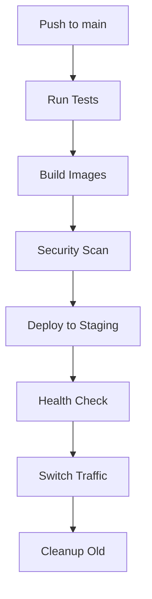

# ZeroShift

**Zero-Downtime Blue-Green Deployment Infrastructure**

ZeroShift is a production-ready Go-based backend infrastructure that implements a blue-green deployment pattern with zero downtime. This project demonstrates modern DevOps practices, containerization, and automated deployment strategies.

[](https://github.com/jjacobsonn/ZeroShift/actions)
[](https://www.docker.com/)
[](https://golang.org/)
[](LICENSE)

## Architecture

```
┌─────────────────┐    ┌─────────────────┐    ┌─────────────────┐
│   Load Balancer │    │   Nginx Proxy   │    │   Blue Service  │
│   (Port 80)     │───▶│   (Port 80)     │───▶│   (Port 8081)   │
└─────────────────┘    └─────────────────┘    └─────────────────┘
                                │
                                ▼
                       ┌─────────────────┐
                       │  Green Service  │
                       │   (Port 8082)   │
                       └─────────────────┘
```

### Components

- **Blue Service**: Production environment (currently live)
- **Green Service**: Staging environment (for new deployments)
- **Nginx Proxy**: Reverse proxy that routes traffic between environments
- **Switch Script**: CLI tool to toggle between blue and green
- **GitHub Actions**: Automated CI/CD pipeline

## Quick Start

### Prerequisites

- Docker & Docker Compose
- Go 1.21+
- curl (for testing)

### Local Development

1. **Clone the repository**
   ```bash
   git clone https://github.com/jjacobsonn/ZeroShift.git
   cd ZeroShift
   ```

2. **Start the infrastructure**
   ```bash
   cd deploy
   docker-compose up -d
   ```

3. **Check status**
   ```bash
   ./switch.sh status
   ```

4. **Test the deployment**
   ```bash
   # Test main endpoint
   curl http://localhost/
   
   # Test health endpoints
   curl http://localhost/health
   curl http://localhost:8081/health  # Blue
   curl http://localhost:8082/health  # Green
   ```

## Blue-Green Deployment

### How It Works

1. **Two Identical Environments**: Blue and Green services run simultaneously
2. **Traffic Routing**: Nginx proxy routes all traffic to the "live" environment
3. **Deployment Process**:
   - Deploy new version to the "staging" environment
   - Run health checks to ensure it's working
   - Switch traffic from live to staging
   - Old environment becomes new staging

### Manual Switch

```bash
# Switch to blue environment
./switch.sh blue

# Switch to green environment
./switch.sh green

# Check current status
./switch.sh status

# Check health of all services
./switch.sh health
```

### Example Output

```bash
ZeroShift Blue-Green Deployment Status
==========================================
Current Live Environment: blue

Container Status:
  Blue Environment:  ✅ zeroshift-blue
  Green Environment: ✅ zeroshift-green
  Proxy:             ✅ zeroshift-proxy

Health Endpoints:
  Blue:  http://localhost:8081/health
  Green: http://localhost:8082/health
  Proxy: http://localhost/health

Main Endpoints:
  Blue:  http://localhost:8081/
  Green: http://localhost:8082/
  Proxy: http://localhost/
```

## Docker Setup

### Services

- **Blue Service**: `zeroshift-blue:8081`
- **Green Service**: `zeroshift-green:8082`
- **Nginx Proxy**: `zeroshift-proxy:80`

### Docker Compose

```yaml
version: '3.8'
services:
  blue:
    build: ../blue
    ports: ["8081:8081"]
    healthcheck:
      test: ["CMD", "wget", "--no-verbose", "--tries=1", "--spider", "http://localhost:8081/health"]
      
  green:
    build: ../green
    ports: ["8082:8082"]
    healthcheck:
      test: ["CMD", "wget", "--no-verbose", "--tries=1", "--spider", "http://localhost:8082/health"]
      
  proxy:
    build: ../proxy
    ports: ["80:80"]
    depends_on:
      blue: { condition: service_healthy }
      green: { condition: service_healthy }
```

## CI/CD Pipeline

### GitHub Actions Workflow

The project includes a comprehensive CI/CD pipeline:

1. **Test & Build**: Run tests and build Docker images
2. **Security Scan**: Vulnerability scanning with Trivy
3. **Deploy Staging**: Deploy to staging environment (develop branch)
4. **Deploy Production**: Deploy to production (main branch)
5. **Rollback**: Manual rollback capability

### Deployment Process



### Required Secrets

Configure these secrets in your GitHub repository:

- `AWS_ACCESS_KEY_ID`: AWS access key
- `AWS_SECRET_ACCESS_KEY`: AWS secret key
- `AWS_REGION`: AWS region
- `EC2_HOST`: EC2 instance IP/hostname
- `EC2_USERNAME`: SSH username
- `EC2_SSH_KEY`: SSH private key

## Testing

### Run Tests

```bash
# Test blue service
cd blue
go test -v

# Test green service
cd green
go test -v
```

### Test Coverage

The project includes comprehensive tests for:
- HTTP endpoints
- Health checks
- Response formats
- Content types
- Error handling

## Project Structure

```
ZeroShift/
├── blue/                    # Blue environment
│   ├── main.go             # Go web server
│   ├── main_test.go        # Tests
│   ├── Dockerfile          # Container definition
│   └── go.mod              # Go module
├── green/                   # Green environment
│   ├── main.go             # Go web server
│   ├── main_test.go        # Tests
│   ├── Dockerfile          # Container definition
│   └── go.mod              # Go module
├── proxy/                   # Nginx reverse proxy
│   ├── nginx.conf          # Nginx configuration
│   └── Dockerfile          # Container definition
├── deploy/                  # Deployment configuration
│   ├── docker-compose.yml  # Service orchestration
│   ├── switch.sh           # Traffic switch script
│   └── live.txt            # Current live environment
├── .github/workflows/       # CI/CD pipelines
│   └── deploy.yml          # GitHub Actions workflow
└── README.md               # This file
```

## Configuration

### Environment Variables

- `PORT`: Service port (default: 8081 for blue, 8082 for green)
- `REGISTRY`: Docker registry (default: ghcr.io)
- `IMAGE_NAME`: Docker image name

### Nginx Configuration

The proxy uses dynamic configuration that can be updated via the switch script:

```nginx
# Upstream definitions
upstream blue_backend {
    server blue:8081;
    keepalive 32;
}

upstream green_backend {
    server green:8082;
    keepalive 32;
}

# Dynamic routing
location / {
    include /etc/nginx/backend.conf;
    proxy_pass http://$backend;
}
```

## Security Features

- **Non-root containers**: All services run as non-root users
- **Multi-stage builds**: Optimized Docker images
- **Health checks**: Built-in health monitoring
- **Vulnerability scanning**: Automated security scanning
- **Secrets management**: Secure credential handling

## Monitoring

### Health Endpoints

- **Proxy Health**: `GET /health`
- **Blue Health**: `GET /health` (port 8081)
- **Green Health**: `GET /health` (port 8082)

### Health Check Response

```json
{
  "status": "healthy",
  "version": "1.0.0",
  "color": "blue",
  "timestamp": "2024-01-15T10:30:00Z",
  "uptime": "2h 15m 30s"
}
```

## Troubleshooting

### Common Issues

1. **Service not starting**
   ```bash
   docker-compose logs [service-name]
   ```

2. **Health check failing**
   ```bash
   curl -v http://localhost:8081/health
   curl -v http://localhost:8082/health
   ```

3. **Switch not working**
   ```bash
   ./switch.sh status
   docker exec zeroshift-proxy nginx -t
   ```

### Logs

```bash
# View all logs
docker-compose logs -f

# View specific service
docker-compose logs -f blue
docker-compose logs -f green
docker-compose logs -f proxy
```

## Contributing

1. Fork the repository
2. Create a feature branch (`git checkout -b feature/amazing-feature`)
3. Commit your changes (`git commit -m 'Add amazing feature'`)
4. Push to the branch (`git push origin feature/amazing-feature`)
5. Open a Pull Request

### Development Guidelines

- Follow Go best practices
- Add tests for new features
- Update documentation
- Ensure Docker builds work
- Test the switch functionality

## License

This project is licensed under the MIT License - see the [LICENSE](LICENSE) file for details.

## Acknowledgments

- Inspired by modern DevOps practices
- Built with Go, Docker, and Nginx
- Automated with GitHub Actions
- Designed for production use

---

**ZeroShift** - Zero downtime, maximum reliability # Test commit to verify Docker tag fix
